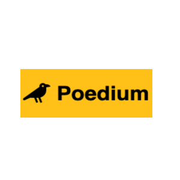

# Poedium

Is a full-stack application that seeks to clone the medium.com experience.

As more people are trying to find a way to show their poetic side, Poedium strives to fullfill their dreams.

More information can be found on this project at it's [Wiki](https://github.com/mikethecodegeek/medium-clone/wiki)

<!-- PROJECT LOGO -->
<br />
<p align="center">
  <a href="https://github.com/mikethecodegeek/medium-clone">
    
  </a>

  <h3 align="center">Poedium</h3>

  <p align="center">
    A Poet's Community
    <br />
    <a href="https://github.com/mikethecodegeek/medium-clone"><strong>Explore the docs »</strong></a>
    <br />
    <br />

  </p>
</p>

<!-- TABLE OF CONTENTS -->

  <summary><h2 style="display: inline-block">Table of Contents</h2></summary>
  <ol>
    <li>
      <a href="#about-the-project">About The Project</a>
      <ul>
        <li><a href="#built-with">Built With</a></li>
      </ul>
    </li>
    <li>
     <a href="#live-link">Live Link To Project</a>
    </li>
    <!-- <li>
     <a href="#demonstration">Demonstration of Project</a>
    </li> -->
    <li>
      <a href="#getting-started">Getting Started</a>
      <ul>
        <li><a href="#prerequisites">Prerequisites</a></li>
        <li><a href="#installation">Installation</a></li>
      </ul>
    </li>
    <li><a href="#license">License</a></li>
    <li><a href="#contact">Contact</a></li>
  </ol>
  
<br>
<br>

<!-- ABOUT THE PROJECT -->

## About The Project

A full stack application that draws inspiration from medium.com.

<br><br/>

## Live Link

Live Link For This Project Can Be Found [Here](https://poedium.herokuapp.com/)

<br><br/>

## Built With

<br>

**Pug**
<br>
<br>

<p align="left">
  <a href="https://pugjs.org//">
    
  </a>
<br>
<br>

**Express**
<br>
<br>

<p align="left">
  <a href="https://expressjs.com/">
    
  </a>
<br>
<br>

**Javascript**
<br>
<br>

<p align="left">
  <a href="https://www.javascript.com/">
    
  </a>
<br>
<br>

**PostGresSQ**
<br>
<br>
<a href="https://www.postgresql.org/">

</a>
<br>
<br>

<p/>

<!-- GETTING STARTED -->

## Getting Started

To get a local copy up and running follow these simple steps.

### Prerequisites

This is an example of how to list things you need to use the software and how to install them.

- npm
  ```bash
  npm install npm@latest -g
  ```

### Installation

1. Clone the repo
   ```bash
   git clone https://github.com/mikethecodegeek/medium-clone
   ```
2. Install NPM packages

   ```bash
   npm install
   ```

3. Create a **.env** file based on the example with proper settings for your
   development environment

4. Setup your PostgreSQL user, password and database and make sure it matches your **.env** file

5. Get into your dotenv sequelize command interface, migrate your database, seed your database, and run your express app from your frontend and backend folders

   ```bash
   npx dotenv sequelize-cli db:migrate
   ```

   ```bash
   npx dotenv sequelize-cli db:seed:all

   ```

   ```bash
    npm start
   ```

---

<!-- LICENSE -->
<br>
<br>

## License

Distributed under the MIT License. See `LICENSE` for more information.

<!-- CONTACT -->

## Contact

Project Link: [GitHub Project Link](https://github.com/mikethecodegeek/medium-clone/)
